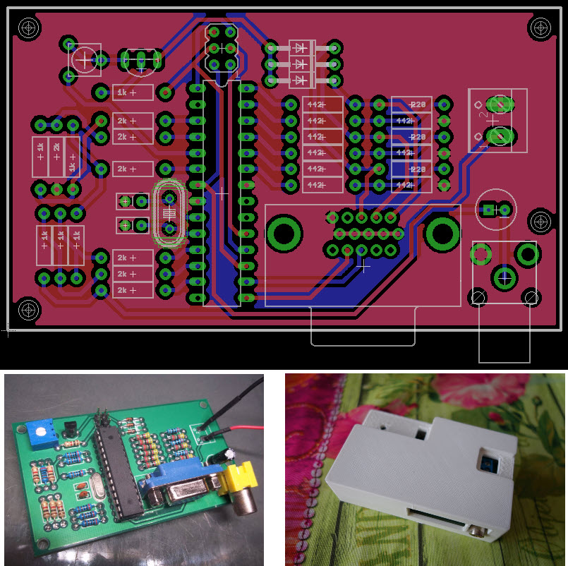

# CRAFT AVR Demo — Custom PCB and 3D Enclosure

This repository contains a custom **double-layer PCB** design and a **3D-printable enclosure** for running the [CRAFT demo](http://www.linusakesson.net/scene/craft/) by Linus Åkesson on an **ATmega88-20PU** microcontroller.

The project is developed in **Autodesk EAGLE** for the PCB layout and includes an **STL enclosure model** designed for FDM 3D printing.

---

## 📦 Contents

- `eagle/`: EAGLE schematic (`.sch`) and board layout (`.brd`)
- `enclosure/`: 3D enclosure model (`.stl`)
- `firmware/`: Precompiled HEX file and Flipper Zero-compatible firmware folder
- `README.md`: Project documentation

---

## ⚙️ Features

- Runs the original CRAFT demo at **20 MHz**
- Audio synthesized in real-time by the ATmega88
- Double-layer PCB with clear silkscreen labeling
- Compact size with mounting holes for enclosure
- Powered via ISP header or screw terminal in 3.3 volts

---

## 📋 Bill of Materials (BOM)

| Qty | Component              | Value/Type         |
|-----|------------------------|--------------------|
| x7  | Resistor               | 2 kΩ               |
| x6  | Resistor               | 1 kΩ               |
| x9  | Resistor               | 442 Ω              |
| x3  | Resistor               | 220 Ω              |
| x2  | Capacitor              | 22 pF              |
| x1  | Capacitor              | 10 µF              |
| x3  | Diode                  | 1N4148             |
| x1  | Transistor             | BC560C             |
| x1  | Trimmer Potentiometer  | 1 kΩ               |
| x1  | Microcontroller        | ATmega88-20PU      |
| x1  | Crystal Oscillator     | 20 MHz             |
| x1  | VGA Socket (Female)    | Through-hole       |
| x1  | RCA Socket (Female)    | Through-hole       |
| x1  | Screw Terminal         | 2-pin              |

---

## 🖨️ Enclosure

- Format: `.stl` for 3D printing
- Designed for FDM printers (0.4 mm nozzle recommended)
- Includes cutouts for VGA, RCA, power terminal, and ISP pins
- Snap-fit
- PCB enclosure case.STL need to be printed with support.

---

## 🛠️ Flashing the Firmware

The `firmware/` folder includes:

- `flash.hex` — Precompiled firmware for ATmega88-20PU
- `AVR Flasher/` — Folder structure compatible with **Flipper Zero**

### 🔧 Flashing with Flipper Zero

1. Copy the content of `AVR Flasher/` folder to your Flipper Zero's SD card in (`/apps_data/avr_isp/`).
2. Connect your Flipper to the CRAFT PCB via the ISP header.
3. Open the [**AVR Flasher**](https://lab.flipper.net/apps/avr_isp) app on your Flipper.
4. Select Craft_pcb.avr firmware and flash it directly to the ATmega88.

---

## 🧠 Credits

- **Original CRAFT demo** by [Linus Åkesson](http://www.linusakesson.net/)
- **PCB and enclosure design** by myself for my hackerspace.